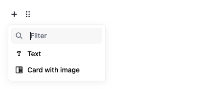
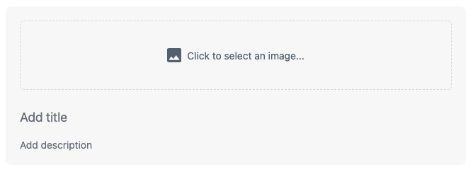
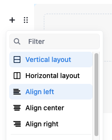

# Card Image Tool for Editor.js

Provides Card Image blocks for the [Editor.js](https://editorjs.io/).




## Features
- **Image Field**: Select, replace, or delete the card image
- **Title Field**: Descriptive labels for your card image
- **Description Field**: Additional context or details
- **Content Alignment**: Left, center, or right alignment options
- **Layout**: Vertical or horizontal layout options
- **HTML Support**: All fields support rich text formatting




## Installation

Use your package manager to install the package `editorjs-card-image`.

```bash
npm install editorjs-card-image

yarn add editorjs-card-image
```

## Usage Example

### Basic Setup

```javascript
import EditorJS from "@editorjs/editorjs"
import CardImage from "editorjs-card-image"

const editor = new EditorJS({
  tools: {
    cardImage: CardImage,
  },
})
```

### With Custom Configuration

```javascript
const editor = new EditorJS({
  tools: {
    cardImage: {
      class: CardImage,
      inlineToolbar: ["bold", "italic"],
      config: {
        addImageButtonPlaceholder: "Click to select an image...",
        titlePlaceholder: "Add a title",
        descriptionPlaceholder: "Add description",
      },
    },
  },
})
```

### Output Data

```json
{
  "type": "cardImage",
  "data": {
    "file": {
      "url": "https://example.com/image.jpg"
    },
    "title": "Customer Satisfaction",
    "description": "Based on 1,200+ reviews",
    "align": "center",
    "layout": "vertical"
  }
}
```

## Development

This tool uses [Vite](https://vitejs.dev/) as builder.

**Commands**

`npm run dev` — run development environment with hot reload

`npm run build` — build the tool for production to the `dist` folder

## Configuration Options
| Option                   | Type       | Default                           | Description                                   |
| ------------------------ | ---------- | --------------------------------- | --------------------------------------------- |
| `addImageButtonPlaceholder` | `string` | `'Click to select an image...'` | Button text when no image is selected      |
| `replaceImageButtonPlaceholder` | `string` | `'Replace image'`              | Button text when an image is selected      |
| `deleteImageButtonPlaceholder`  | `string` | `'Delete image'`               | Button text for deleting the selected image |
| `selectFiles`           | `function` | `undefined`                       | Optional selector used instead of the native file picker; return `{ success: 1, file: { url } }` or `{ url }` |
| `titlePlaceholder`       | `string`   | `'Add title'`                     | Placeholder text for title field            |
| `descriptionPlaceholder` | `string`   | `'Add description'`               | Placeholder text for description field      |

## Links

[Editor.js](https://editorjs.io) • [Create Tool](https://github.com/editor-js/create-tool)
